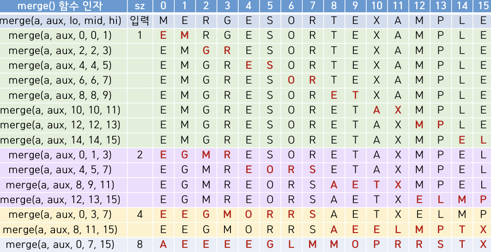
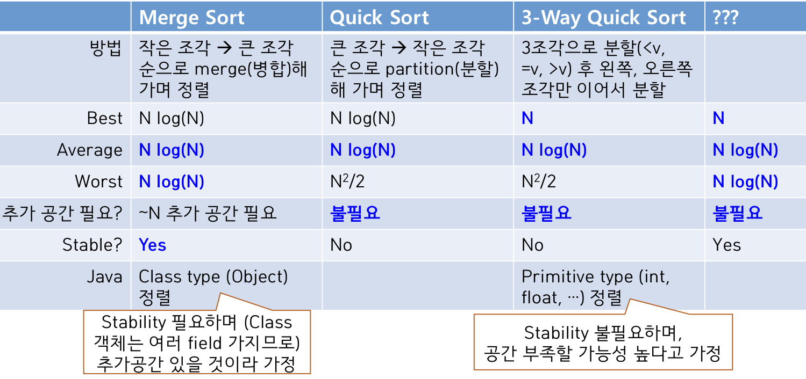

# Merge Sort
: 두 정렬된 배열을 ~N 시간에 하나의 배열에 정렬된 상태로 병합해(merge) 담을 수 있다는 사실에 기반한 방법

## 1. 수행 방법
- 두 배열이 a[low ~ mid]와 a[mid+1 ~ hi]에 담겨 있고 각각 오름차순으로 정렬되어 있다고 가정
- 두 배열의 시작 지점에 포인터 하나씩 둠
    - i = low, j = mid + 1
- a[i]와 a[j] 중 더 작은 쪽을 결과 배열에 담고 담은 쪽의 포인터를 증가시키는 것을 반복
- 한 배열을 결과 배열에 모두 옮겨 담았으면(i > mid or j > hi) 다른 배열에 남은 값을 차례로 결과 배열에 옮겨 담음

## 2. 특징
Merge 하기 위해 ~N 만큼의 추가 공간 필요함
- 정렬한 결과를 담을 때
- 정렬 전에 입력 데이터 a[]를 추가 공간에 옮겨 담은 후 정렬한 결과를 a[]에 다시 저장

## 3. 동작 원리
크기가 1인 N개의 조각들로 분리 → 인접한 두 조각끼리 merge 반복  
⇒ 최종적으로 2개의 정렬된 조각이 남음 → Merge 수행하면 전체 정렬된 상태 됨  
- 두 배열의 크기가 1이면 애초에 merge 만으로도 정렬 가능 

## 4. Code
- Merge Code
```python
# Merge a[lo ~ mid] with a[mid+1 ~ hi],
# using the extra space aux[]
def merge(a, aux, lo, mid, hi):
    # Copy elements in a[] to the auxiliary array aux[]
    # 추가 공간 aux[]에 복사함 
    for k in range(lo, hi+1):
        aux[k] = a[k]

    i, j = lo, mid+1
    for k in range(lo, hi+1):
        # 첫 번째 조각의 값을 모두 a[]에 옮겨 담았으면 두 번째 조각의 값을 a[]에 차례로 옮겨 담음
        if i > mid: a[k], j = aux[j], j + 1
        # 두 번째 조각의 값을 모두 a[]에 옮겨 담았으면 첫 번째 조각의 값을 a[]에 차례로 옮겨 담음
        elif j > hi: a[k], i = aux[i], i + 1
        # aux[i]와 aux[j] 중 더 작은 값을 a[]에 옮겨 담고, 담은 쪽의 포인터를 1 증가시킴
        elif aux[i] <= aux[j]: a[k], i = aux[i], i + 1
        else: a[k], j = aux[j], j + 1
```
- Merge Sort Code
```python
# Halve a[lo ~ hi], sort each of the halves, and merge them,
# using the extra space aux[]
def divideMerge(a, aux, lo, hi):
    if (hi <= lo): return a     # 조각의 길이가 1이 되면 리턴
    mid = (lo + hi) // 2    # 두 조각으로 나눔
    # 정렬 
    divideNMerge(a, aux, lo, mid)
    divideNMerge(a, aux, mid+1, hi)
    merge(a, aux, lo, mid, hi)  # 합병 

def mergeSort(a):
    # Create the auxiliary array once and
    # re-use for all subsequent merges
    # 추가 공간 aux[] 생성
    aux = [None] * len(a)

    divideNMerge(a, aux, 0, len(a) - 1)
```
- 다른 함수가 아닌 mergeSort(a)에서 추가 공간 aux[]를 만드는 이유 : 다른 함수에서 매번 aux[]를 다시 만들면 메모리 할당에 불필요한 시간이 많이 소요됨

## 5. 성능
(1) 두 값 간의 대소 비교 (2) 메모리 접근

### 대소 비교
N개의 값 merge를 위해 1 ~ 3회의 비교 진행 → N에 비례한 횟수의 비교
### 메모리 접근
- N개의 값 merge를 위해 1 ~ 3회의 메모리 접근 → N에 비례한 횟수 수행
- N개 원소를 크기 1이 될 때까지 두 조각으로 나눈 후 인접한 두 조각끼리 merge → N * log<sub>2</sub>N에 비례한 횟수 수행  
⇒ 전체 ~N회 작업을 ~log<sub>2</sub>N회 수행 → ~Nlog<sub>2</sub>N (거의 정렬된 상태라도 예외 X)

---
# Quick Sort
: 정렬할 원소 중 하나를 기준값 v로 정한 후 <= v인 원소를 v 왼쪽에 >= v인 왼소를 v 오른쪽에 두는 분할(Partition)을 반복 적용하는 방법

## 1. 수행 방법
- 첫 원소 a[low]를 기준값 v로 정함
- 기준값 제외한 배열의 양 끝에 포인터 하나씩 설정
    - i = low + 1, j = hi
- j <= i 될 때까지 반복
    - v보다 큰 a[i] 나올 때까지 i를 1씩 증가시킴
    - v보다 작은 a[j] 나올 때까지 j를 1씩 감소시킴
    - a[i]와 a[j] swap함
- j <= i되면 v를 두 partition 경계에 있는 값과 swap 함
    - 각 원소에 대해 1번의 비교와 0 ~ 1번의 swap 진행 ⇒ ~N 작업 수행
- 두 조각으로 partition 한 후에 각 조각을 다시 같은 방식으로 partition 해 가는 것을 반복 ⇒ 크기 <= 2인 부분 집합들 Partition
    - N개 원소에 partition 수행해 기준값 v를 중심으로 두 조각으로 분할하면 v는 정렬한 위치에 오지만 나머지는 다시 그 안에서 정렬 필요
    - 정렬할 배열의 크기가 2면 Partition 만으로 정렬 가능
- Partition 끝나면 N개 전체가 정렬된 상태가 됨

## 2. Code
- Partition Code
```python
# Partition a[lo ~ hi] using a[lo] as the partitioning item
def partition(a, lo, hi):
    # 기준값 제외한 양 끝에 포인터 i, j 둠
    i, j = lo + 1, hi

    # 각 원소를 기준값과 비교해서 분할
    while True:
        # 기준값보다 큰 a[i] 나올 때까지 i 증가
        while i <= hi and a[i] < a[lo]: i = i + 1
        # 기준값보다 작은 a[j] 나올 때까지 j 감소
        while j >= lo + 1 and a[j] > a[lo]: j = j - 1
        # 두 포인터가 서로를 지나치면 분할 끝
        if (j <= i): break      # Break if the pointers cross
        # 기준값보다 작은 원소가 왼쪽, 큰 원소가 오른쪽에 가도록 함
        a[i], a[j] = a[j], a[i]     # Swap a[i] and a[j]
        i, j = i + 1, j - 1

    # partition 경계값과 swap
    a[lo], a[j] = a[j], a[lo]   # Swap a[j] with partitioning item
    # 기준값의 index 반환
    return j    # Return the index of item in place
```
- Quick Sort Code
```python
# Partition a[lo ~ hi] and
# continue to partition each half recursively
def divideNPartition(a, lo, hi):    # lo ~ hi까지 Quick Sort로 정렬
    # 조각 길이 1이면 정렬 끝
    if (hi <= lo): return
    # 두 조각으로 Partition
    j = partition(a, lo, hi)
    # 각 조각들 정렬
    divideNPartition(a, lo, j - 1)
    divideNPartition(a, j + 1, hi)

def quickSort(a):
    # Randomly shuffle a,
    # so that the partitioning item is chosen randomly
    # 임의의 값이 기준값으로 선정돼 partition 결과 두 조각의 크기가 크게 차이가 나는 상황을 줄이기 위해
    random.shuffle(a)

    divideNPartition(a, 0, len(a) - 1)
```
- 두 조각의 크기가 균등할수록 정렬 시간이 줄어듦 & 크기 차이 많이날수록 정렬 시간 오래 걸림

## 3. 성능
(1) 두 값 간의 대소 비교 (2) Swap
- N개 값 partition → ~N의 비교 / 메모리 접근
- partition 횟수에 따른 성능 차이
    - Best Case : N개의 값을 정확히 반으로 partition → ~NlogN
    - Worst Case : 크기가 N - 1인 조각만 계속 나오는 경우 → N + (N - 1) + ... + 1 = ~N<sup>2</sup>/2
        - 이 경우 줄이려고 random하게 shuffle함

---
# Bottom-Up Merge Sort
: Merge Sort의 개선

## 1. Merge Sort의 단점
입력 배열을 나누어가는 과정에서 재귀호출 계속됨 → 시간 / 공강 overhead 큼
- 함수 호출 / 반환 과정에서 함수 인자, 지역 변수 등을 메모리에 저장 / 삭제 반복해야 함  
→ 추가적인 시간 필요 & 연속 재귀호출 반복 시 stack 영역에 할당된 공간이 부족해서 stack overflow 오류 발생

## 2. 수행 방법
Divide 위해 재귀 호출하는 과정 생략하고 merge만 수행
- sz = 1부터 시작해서 크기가 sz인 인접한 부분집합끼리 병합
- sz * 2 하면서 sz >= N 될 때까지 반복


## 3. Code
```python
def mergeSort(a):
    # Create the auxiliary array
    aux = [None] * len(a)

    sz = 1      # 1부터 시작
    while (sz < len(a)):    # size 결정
        # lo + sz <len(a)의 이유 : mid와 hi값 설정 시 배열의 길이를 초과하는 인덱스에 접근하게 될 수 있어서
        for lo in range(0, len(a) - sz, sz * 2):    # size에 맞게 Merge 함
            # 마지막 인자에 min() 사용한 이유 : 나도 모름..왜?
            merge(a, aux, lo, lo + sz - 1, min(lo + sz + sz - 1, len(a) - 1))
        sz += sz    # Multiply by 2

# Merge 함수는 Merge Sort와 동일함
# Merge a[lo ~ mid] with a[mid+1 ~ hi],
# using the extra space aux[]
def merge(a, aux, lo, mid, hi):
    # Copy elements in a[] to the auxiliary array aux[]
    for k in range(lo, hi+1):
        aux[k] = a[k]

    i, j = lo, mid+1
    for k in range(lo, hi+1):
        if i > mid: a[k], j = aux[j], j + 1
        elif j > hi: a[k], i = aux[i], i + 1
        elif aux[i] <= aux[j]: a[k], i = aux[i], i + 1
        else: a[k], j = aux[j], j + 1
```
- 기존 Top-down 방식 Merge Sort에서 divideNMerge() 전체 빠짐 + mergeSort(a) 내부 변화   
→ 연속 재귀함수 호출 ↓ ⇒ 시간 및 공간 효율 ↑

## 4. Merge Sort VS Bottom-up Merge Sort
- Merge Sort : (1) 재귀 호출하며 쪼갠 후(Top-down) (2) 반환하며 병합&정렬(Bottom-up)
- Bottom-up Merge Sort : 병합&정렬(Bottom-up)

---
# Sorting Complexity
정렬 알고리즘의 주된 일 : 원소 간의 대소 비교 ⇒ 원소 간 비교 횟수와 정렬할 원소 개수 N과의 관계 알면 시간 알 수 있음

## 1. 트리 형태(Dicision Tree)로 대소 비교 결과로 나올 수 있는 모든 가능한 경우 작성
- Tree의 깊이가 나타내는 것 : 비교 횟수
- 깊이 h인 이진 트리의 최대 잎의 개수 : 2<sup>h</sup>개
- N개 원소에 대한 모든 가능한 정렬이 잎에 한 번은 나오려면 필요한 잎의 최소 개수 : N!
- N(정렬할 원소 개수)과 h(worst-case 비교 횟수) 간의 관계 : N! <= 2<sup>h</sup> ⇒ log<sub>2</sub>N! <= h ⇒ ~NlogN <= h
- 즉, N개의 서로 다른 원소 있는 경우 <U>**최적의 정렬 방법은 ~NlogN회 대소 비교 필요**</U>
    - BUT 완전 최적 개선은 X
        - ex) 서로 같은 원소 있는 경우 존재
        - ex) 정렬 외 만족시켜야 할 성질이 존재 (안정성, 추가 공간 필요 여부)

---
# Stability of Sorting
## 1. 개념
정렬 전후 key가 같은 원소 간 상대 순서 보존하는 성질
- key : 여러 값으로 이루어진 원소의 경우 정렬에 사용하는 값

## 2. Sorting 별 Stable vs Unstable
### Stable
- Insertion Sort
- Merge Sort
Insertion Sort와 Merge Sort는 비교하는 Unstable하게 만들 수도 있음  
ex) Insertion Sort는 비교 시 등호를 넣으면 Unstable 해지고, Merge Sort는 등호를 빼면 Unstable 해짐
### Unstable
- Selection Sort
- Shell Sort (1-sort만 stable)
- Quick Sort
    - Partition 과정에서 swap 됨
    - 기준값 이동 시 swap 됨
    - 1회 random shuffling에서도 위치 바뀜
### Worst Case에서도 ~Nlog<sub>2</sub>N으로 수행하고 Stable한 Merge Sort가 Quick Sort보다 선호됨

---
# Quick Select
Quick Sort의 partition 시 기준 값은 정렬된 위치에 있게 된다는 점을 활용     
→ k가 속한 쪽만 partition

## 1. 수행 과정
- partition하면 기준 값 a[j]는 정렬된 위치에 있음
    - IF j == k : return a[j]
    - ELIF j < k : 오른쪽 partition만 분할
    - ELIF j > k : 왼쪽 partition만 분할

## 2. Code
```python
# Find k-th smallest element,
# where k = 0 ~ len(a) - 1
def quickSelect(a, k):
    # Randomly shuffle a, so that two
    # partitions are equal-sized
    # shuffle 해야 더 균등하게 분할해 성능에 좋음
    random.shuffle(a)

    lo, hi = 0, len(a) - 1
    while (lo < hi):
        j = partition(a, lo, hi)
        if j < k: lo = j + 1
        elif j > k: hi = j - 1
        else: return a[k]

    return a[k]

# Partition 함수는 동일
# Partition a[lo ~ hi] using a[lo] as the partitioning item
def partition(a, lo, hi):
    i, j = lo + 1, hi

    while True:
        while i <= hi and a[i] < a[lo]: i = i + 1
        while j >= lo + 1 and a[j] > a[lo]: j = j - 1
        if (j <= i): break      # Break if the pointers cross
        a[i], a[j] = a[j], a[i]     # Swap a[i] and a[j]
        i, j = i + 1, j - 1

    a[lo], a[j] = a[j], a[lo]   # Swap a[j] with partitioning item
    return j    # Return the index of item in place
```

## 3. 성능 분석
(공통) N개 값 Partition 위해 N에 비례한 횟수의 비교/메모리 접근 수행
### 평균 : ~2N
- N개 원소를 크기 1이 될 때까지 대략 반으로 나누어 가면 N + N/2 + N/4 + ... + 1 = ~2N에 비례한 횟수의 비교/메모리 접근 수행
- random shuffle 하면 대략 평균에 가깝게 나옴
### Worst Case : ~N<sup>2</sup>/2
- N개 원소를 Partition해서 크기 N - 1인 조각이 계속해서 나오면 N + (N - 1) + (N - 2) + ... + 1 = ~N<sup>2</sup>/2에 비례한 횟수의 비교/메모리 접근 수행

---
# Duplicate Keys and 3-way Partitioning
: Quick Sort의 개선

## 1. 수행 방법
- 기준 값을 중심으로 ~N 시간에 3개 partition으로 분할
- 기준 값이 속한 조각은 제외하고, 좌우 조각에 다시 partition 적용
    - 반복하면 모든 원소 정렬됨
    - 같은 값들을 다 모아서 한 번에 기준 값으로 설정하기 때문에 왼, 오 partition에는 기준 값과 동일한 원소가 없음
### Edsger Dijkstra's 3-way Partitioning
- a[low ~ hi]를 3-way partition 하기 위해 a[low]를 기준 값 v로 정함
- 왼 → 오 방향으로 한 번에 한 원소 a[i] 검사
    - a[i] < v이면 왼쪽 영역의 오른쪽 끝으로 이동(swap) & i++
    - a[i] > v이면 오른쪽 영역의 왼쪽 끝으로 이동(swap)
    - a[i] == v이면 이동시키지 않음 & i++
- i가 오른쪽 영역에 들어서면 검사 중단 

## 2. Code
```python
def partition3Way(a, lo, hi):
    if (hi <= lo): return
    v = a[lo]
    lt, gt = lo, hi   # Pointers to < v and > v sections
    i = lo
    while i <= gt:
        if a[i] < v:    # 왼쪽 영역으로 이동
            a[lt], a[i] = a[i], a[li]   # Swap
            lt, i = lt + 1, i + 1
        elif a[i] > v:
            a[gt], a[i] = a[i], a[gt]   # Swap
            gt = gt - 1
        else: i = i + 1
    
    print(a)

    partition3Way(a, lo, lt - 1)
    partition3Way(a, gt + 1, hi)
```

## 3. 성능 분석
N개 원소 중 n개의 서로 다른 key가 있고 i번째 key가 x<sub>i</sub>개 졵재한다면
- 모든 key가 다르면 (N개 key가 1번씩 나옴) : ~NlogN
- n개 key가 N/n번씩 나오면 : ~Nlogn     
→ n이 작아질수록 (duplicate key가 많을수록) ~N에 가까워짐

## 4. 정리


---
## 학교 수업 실습 및 과제 코드
- [Merge Sort](./School_Code/MergeSort.py)
- [Quick Sort](./School_Code/QuickSort.py)
- [Bottom-up Merge Sort](./School_Code/MergeSortBottomUp.py)
- [Quick Select](./School_Code/QuickSelect.py)
- [Quick Sort 3-way](./School_Code/QuickSort3Way.py)
- [Collinear Points](./School_Code/CollinearPoints.py)