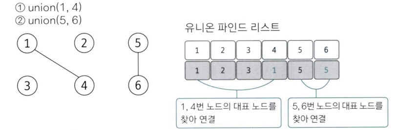
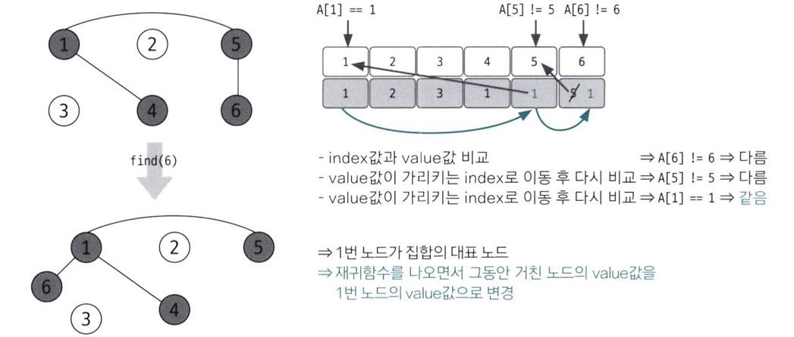

# Union-Find
: 그래프 알고리즘으로 합집합 찾기 알고리즘 (= Disjoint-set)


## 1. 개념
### Disjoint Set (상호 배타적 집합)
: 서로 중복되지 않는 부분 집합들로 나눠진 원소들에 대한 정보를 저장하고 조작하는 자료구조

### Union-Find
: Disjoint Set 표현 시 사용하는 알고리즘    
: Union 연산(여러 노드가 있을 때 특정 2개의 노드를 연결해 1개의 집합으로 묶음) + Find 연산(두 노드가 같은 집합에 속해 있는지 확인)  
: <U>**서로 다른 두 원소가 같은 집합에 속해 있는지 판별**</U>  

- 트리 구조를 이용
- make-set(x)  # 초기화
    - x를 유일한 원소로 하는 새로운 집합 생성
- union(x, y)  # 합침
    - x가 속한 집합과 y가 속한 집합을 합침
- find(x)  # 찾기
    - x가 속한 집합의 대표 노드 반환 → x가 어떤 집합에 속해 있는지 찾기

## 2. 동작 원리
1. 각 노드들이 연결되어 있지 않을 때 각 노드가 대표 노드가 됨. → 자신의 인덱스값으로 리스트 초기화
2. 2개의 노드를 선택해 각각의 대표 노드를 찾아 연결하는 union 연산 수행. → 자식 노드로 들어가는 노드값을 대표 노드값으로 변경   
ex) union(1, 4) 과 union(5, 6) 수행 결과


## 3. 최적화
### 최악의 경우
: 트리구조가 완전 비대칭인 경우 (연결 리스트 형태)
- 트리의 높이가 최대(N - 1)가 됨 → union과 find 연산 시간 복잡도 모두 O(N)

### 최적화
- Find 연산 : 자신이 속한 집합의 대표 노드를 찾는 연산
    - 작동 원리
        - 대상 노드 리스트에 index값과 value값이 동일한지 확인
        - 동일 X시 value값이 가리키는 index 위치로 이동
        - index값과 value값이 같을 때까지 위 과정 반복 (재귀 함수)
        - 대표 노드 도달 시 재귀 함수 빠져나오며 거치는 모든 노드값을 대표 노드값으로 변경
    - 장점 : 경로 압축(Path Compression) → 그래프를 정돈하고 시간 복잡도를 줄임 (O(lgN))
    
- Union 연산
    - Union-by-rank(union-by-height) : rank에 트리의 높이 저장 → 항상 높이가 더 낮은 트리를 높은 트리 밑에 넣음.

## 4. Code
```python
# union(x, y)
def union(x, y):
    x = find(x)
    y = find(y)

    if x < y:
        parent[y] = x
    else:
        parent[x] = y

# find(x)
def find(x):
    if parent[x] != x:
        # 루트 노드가 아니면 루트 노드 찾을 때까지 재귀 호출 
        parent[x] = find(parent[x])
    return parent[x]

# vertex와 edge 입력받기 
vertex, edge = map(int, input().split())
# 부모 자기 자신으로 초기화 
parent = [i for i in range(1, vertex + 1)]

# union 연산 수행
for i in range(edge):
    a, b = map(int, input().split())
    union(a, b)

# 각 원소가 속한 집합 출력
print('각 원소가 속한 집합: ', end = '')
for i in range(1, vertex + 1):
    print(find(i), end = '')

# 부모 테이블 내용 출력
print('\n부모 테이블: ', end = '')
for i in range(1, vertex + 1):
    print(parent[i], end = '')
```

## 5. 문제
- [BOJ-1717](./ex_BOJ/1717/)